## Project Summary

In this project, you will take a newly developed full stack application and deploy it to a cloud service provider so that it is available to customers. This application contains the main components of a 3-tier full stack application (UI, API, and Database).


<iframe width="100%" height="400" src="https://www.youtube.com/embed/hNDIf5wELT4" title="YouTube video player" frameborder="0" allow="accelerometer; autoplay; clipboard-write; encrypted-media; gyroscope; picture-in-picture" allowfullscreen></iframe>

## Project Environment

In your Local Machine Instructions ensure you have the following installed:

✅ Node v14.15.1 (LTS), or more recent. While older versions can work, it is advisable to keep Node to the latest LTS version [Node.js Installer](https://nodejs.org/en/download/)

✅ npm 6.14.8 (LTS), or more recent. Yarn can work but was not tested for this project

✅ AWS CLI v2 [Installing / Updating the latest](https://docs.aws.amazon.com/cli/latest/userguide/getting-started-install.html), v1 can work but was not tested for this project

## You will have to do the following

### 1️⃣ Download Assets 

You will have the choice of using either a starter project [(GitHub link)](https://github.com/udacity/nd0067-c4-deployment-process-project-starter) or the application created during the course of the Fullstack JavaScript Nanodegree. choose what ever you like

### 2️⃣  Provision AWS services 

Provision the necessary AWS services your app needs

#### 🚀 Launch the AWS  Console

Launch the AWS Web Console in your Udacity Classroom, You are given a federated user account, a temporary AWS user account with limited permissions, that you can use in this program.

To log in to an AWS console, click the `button in the left navigation` labeled `Open AWS Gateway` and then `Open AWS Console.` This will open the AWS console in a new browser tab. This may take a few moments to load the first time. See a brief video below for a walkthrough.

<iframe width="560" height="315" src="https://www.youtube.com/embed/hCn59XMZjlY" title="YouTube video player" frameborder="0" allow="accelerometer; autoplay; clipboard-write; encrypted-media; gyroscope; picture-in-picture" allowfullscreen></iframe>

> If you have a pop-up blocker installed, it may prevent the new tab from launching. Please be sure to allow pop-ups from Udacity.

#### 🚀 RDS - Create Postgres DB

> Amazon RDS is a relational database service that manages common database administration tasks, resizes automatically, and is cost-friendly.

Let's see how to create a PostgresSQL database, and view the details of an existing database.

🐻 Navigate to the RDS dashboard. It shows the database-resources summary, such as the count of database instances, the health of the database service, reserved instances, snapshots. You can also view the portion of the allocated storage. You can launch the Create database wizard from here.

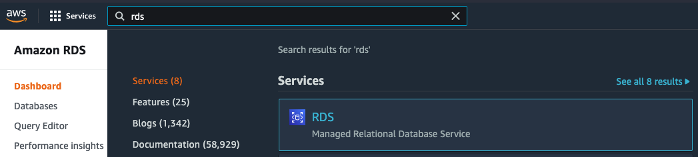

🐻 Create a Database

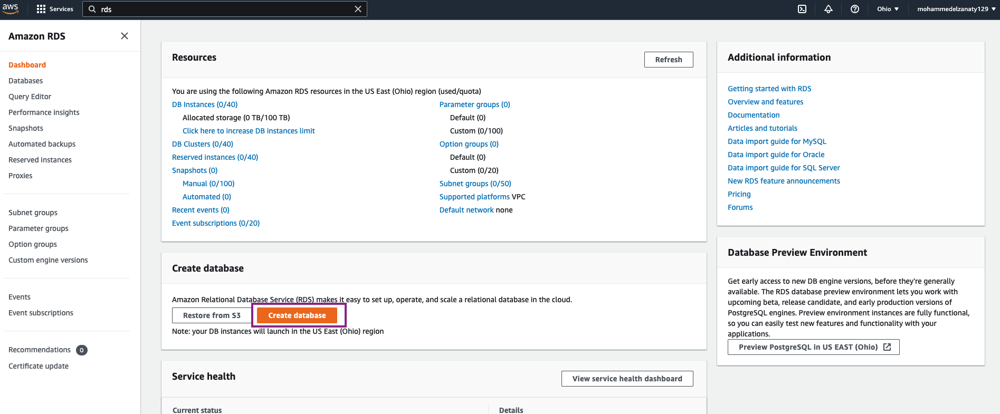

AWS provides two options to choose from:

1. **Standard create** - You have set all of the configuration options, including ones for availability, security, backups, and maintenance.

2. **Easy create** - You use the industry best-practice configurations. All configuration options, except the Encryption and VPC details, can be changed after the database is created.

The snapshot below shows the fields you choose while creating a MySQL database using the `Standard create` option.

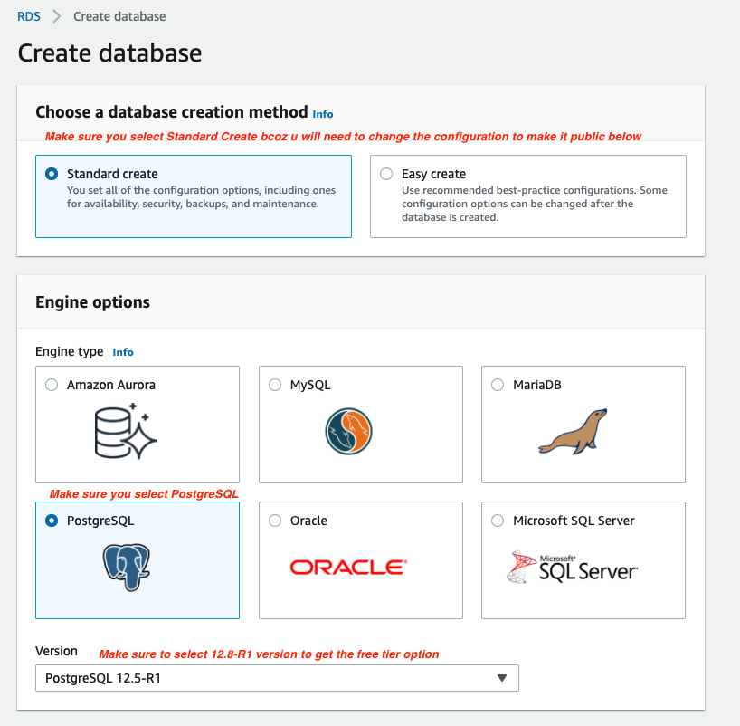
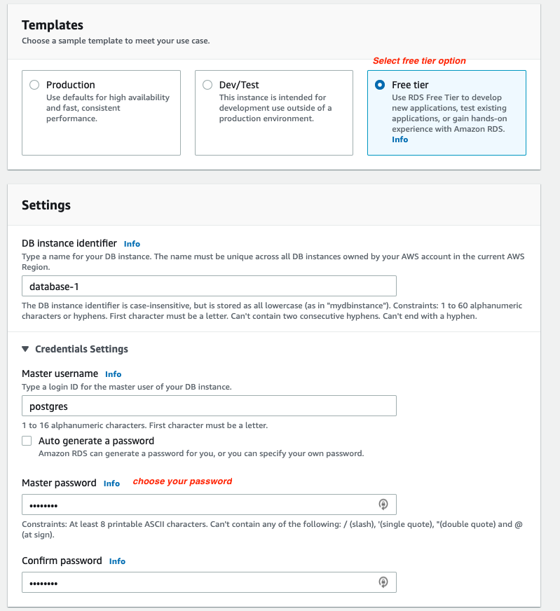
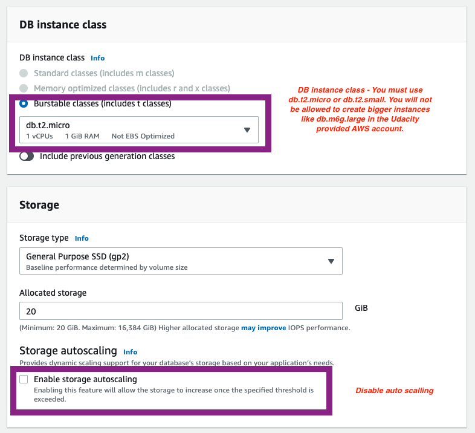
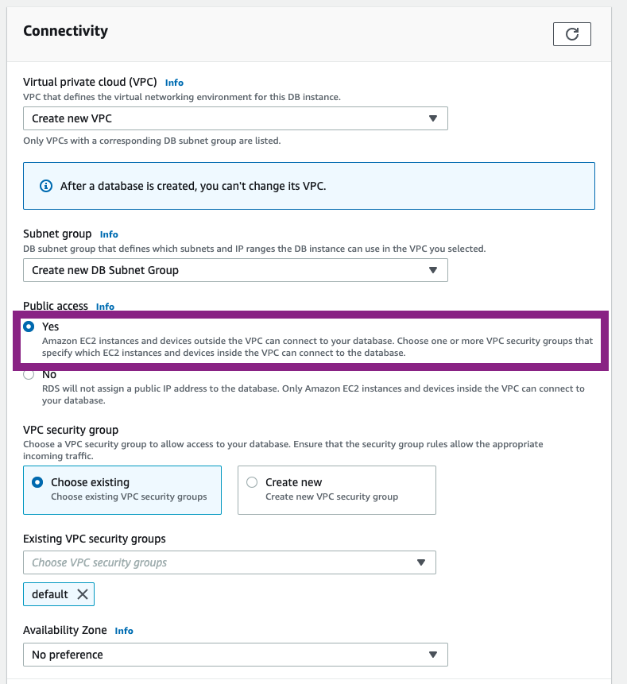
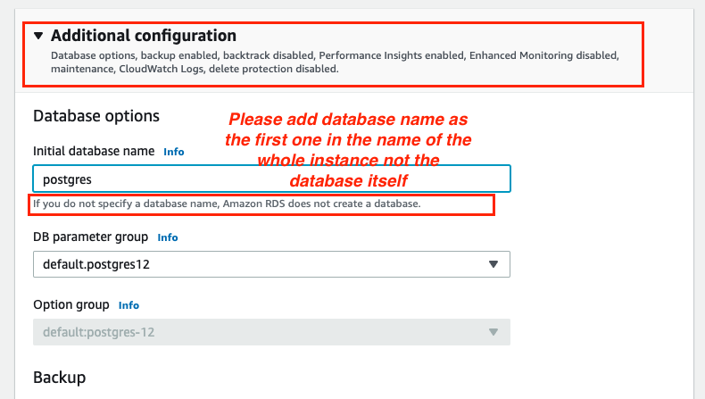
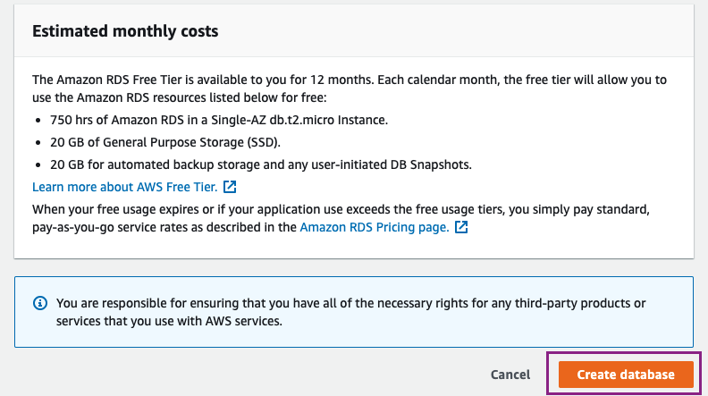

> when creating your RDS instance, make sure you choose to make it publicly accessible (it’s an option that pops up to you when creating the database).


By default, if you create an Amazon RDS MySQL database you won’t be able to connect to it unless you specifically whitelist inbound traffic sources.

I will show you step by step in the easiest way possible how to allow an IP to connect to your RDS instance (in other words, open port 3306).

**Step 1** Choose your RDS database from the list of instances.

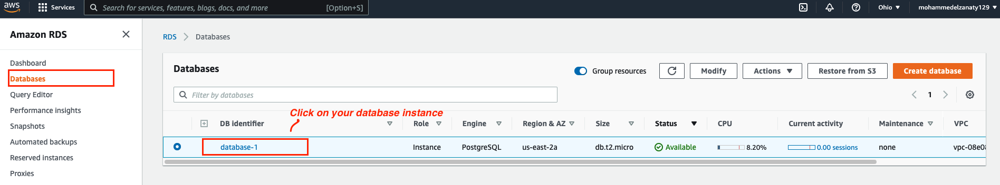


**Step 2** Scroll to the `Connectivity & Security` section then find the “VPC Security groups” and click on the active security group link. This will directly redirect you to the security group you need to whitelist the IP address at.

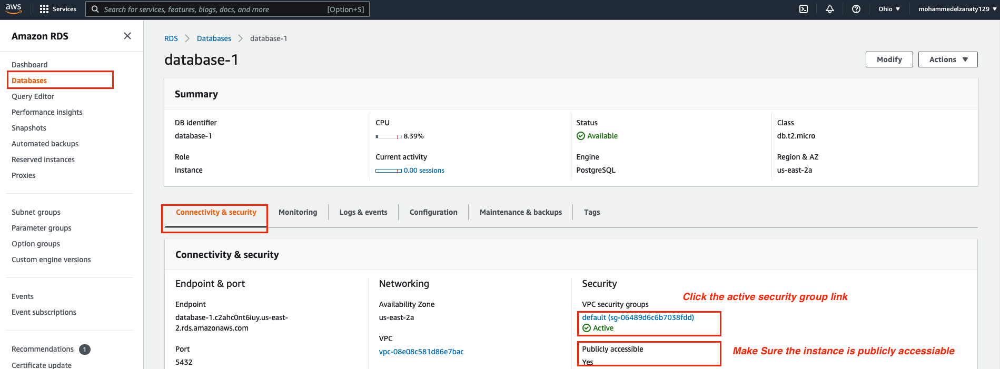

**Step 3** Make sure the security group that belongs to your RDS database is selected/highlighted. 

**Step 4** Click on `Inbound Rules` at the bottom. Then click `Edit Inbound Rules`. 

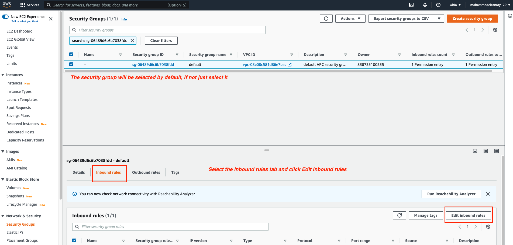

**Step 5** In this last step you will just need to whitelist IP.

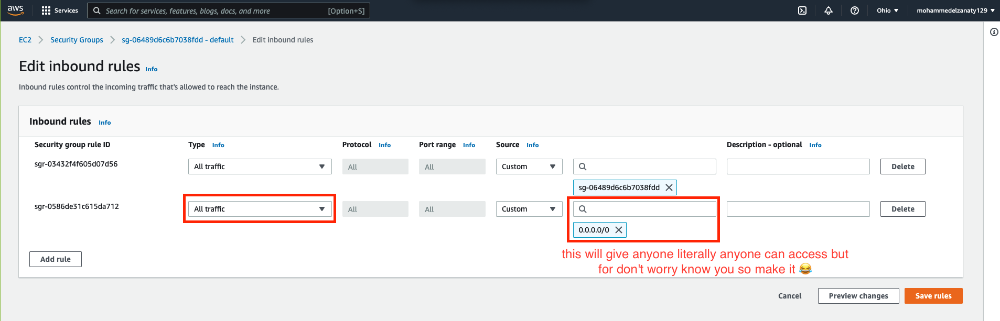

Hit save 😂

now it's time to test we can use [Postbird](https://www.electronjs.org/apps/postbird)

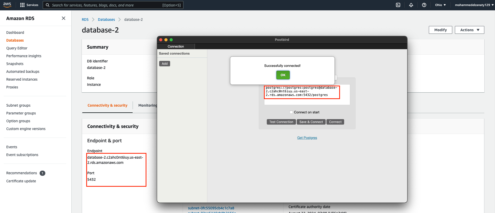

<iframe src="https://giphy.com/embed/S3Ot3hZ5bcy8o" width="480" height="375" frameBorder="0" class="giphy-embed" allowFullScreen></iframe><p><a href="https://giphy.com/gifs/jack-nicholson-nodding-anger-management-S3Ot3hZ5bcy8o">via GIPHY</a></p>

#### 🚀 S3 Bucket

##### 🐻 Create Bucket

1. Navigate to the **AWS Management Console** page, type **S3** in the “Find Services” box and then select **S3** and navigate to it.


2. Click on the **Create bucket** button. It will launch a new wizard. 


3. General configuration

Provide the bucket-name and the region where you want to locate the bucket.

> The bucket name must be unique worldwide, and must not contain spaces or uppercase letters.

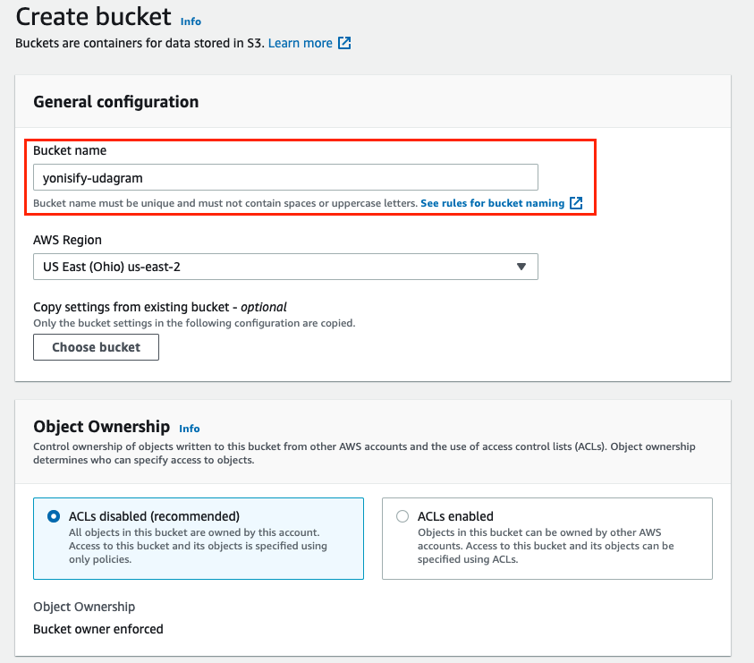

> One of the convenient naming conventions is my-123456789-bucket, where you can replace 123456789 with your 12 digit AWS account ID.


> If you create a bucket from GUI you need to make sure that u login with the user u are using to acess from the termainal if it's not the case there's an error will appears for ACLS and we can avoid all this shit by creating the bucket from our termainal

```bash
aws s3api create-bucket \
    --bucket my-bucket \
    --region us-east-1
```
you can learn more about this from [docs](https://docs.aws.amazon.com/cli/latest/reference/s3api/create-bucket.html)

Now we created the bucket, and later we upload files and folders to it but there's some configuration we need to add to the bucket itself.

4. Public Access settings

**uncheck the Block all public access option.**  It will enable the public access to the bucket objects via the S3 object URL bocz we need our HTML/CSS to be accessable form outside


> Make sure to check ✅ **I acknowledge that the current settings might result in the his bucket and the objects within becoming public**

> We are allowing the public access to the bucket contents because we are going to host a static website in this bucket. Hosting requires the content should be publicly readable.

5. Bucket Versioning and Encryption

👨🏻‍💻 Bucket Versioning - Keep it disabled.
👨🏻‍💻 Encryption - If enabled, it will encrypt the files being stored in the bucket.
👨🏻‍💻 Object Lock - If enables, it will prevent the files in the bucket from being deleted or modified.


Create a bucket - Make it public and now we need to access bucket details

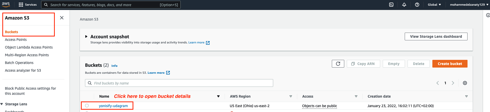

##### 🐻 Set Bucket Policy


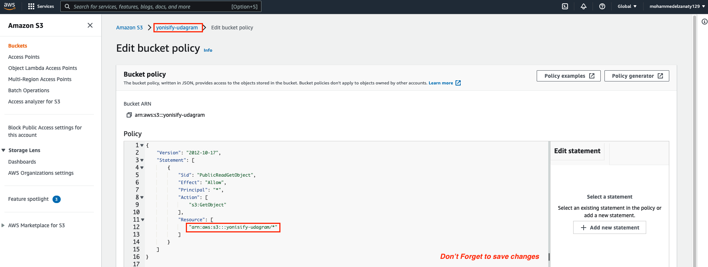

```json
{
    "Version": "2012-10-17",
    "Statement": [
        {
            "Sid": "PublicReadGetObject",
            "Effect": "Allow",
            "Principal": "*",
            "Action": [
                "s3:GetObject"
            ],
            "Resource": [
                "arn:aws:s3:::yonisify-udagram/*"
            ]
        }
    ]
}
```
> Replace `yonisify-udagram` with your bucketname 

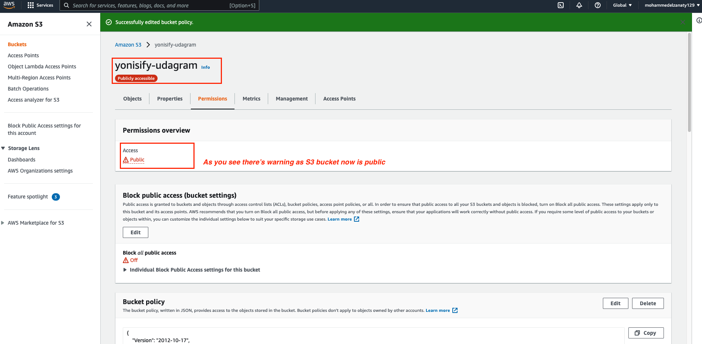

##### 🐻 Configure static website hosting

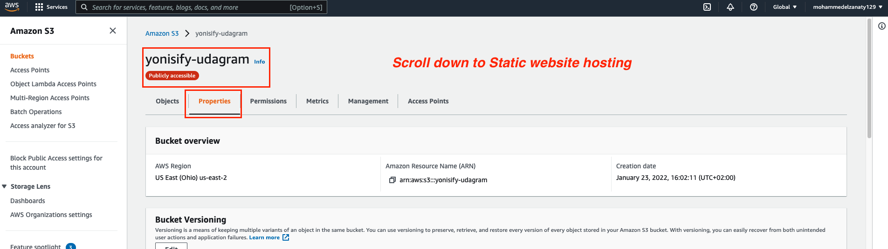
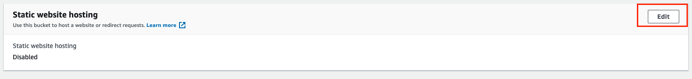
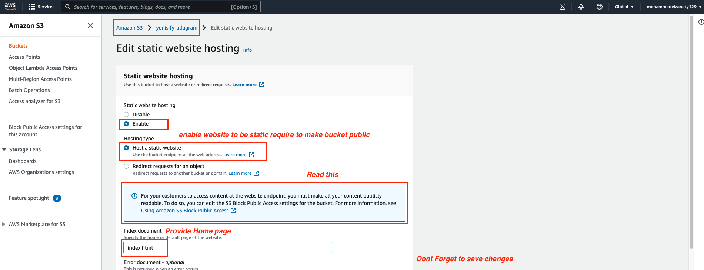


##### 🐻 Upload File/Folders

From the [S3 dashboard](https://s3.console.aws.amazon.com/s3/home), click on the name of the bucket you have created in the step above. and you will find Details of an existing bucket. you can upload now your static files from **upload** button as 

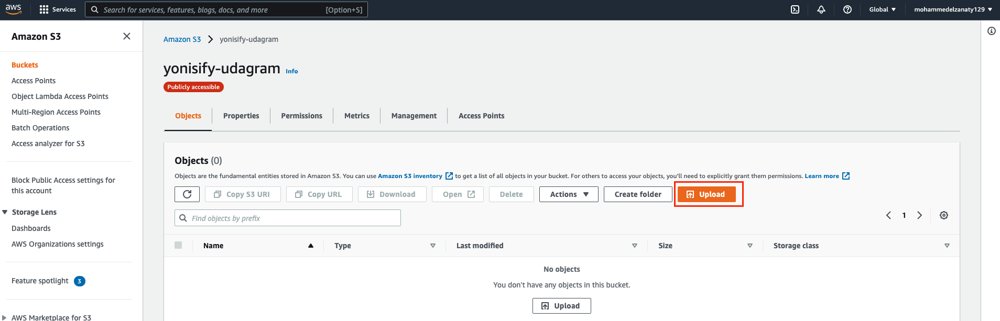

but most of the times after integration with  **CircleCI** you don't have the luxurious to upload every time from GUI so you need some utility to upload from your `terminal` and this can be handle by for example let's say when we build the project `client side` i mean you will get the build version with a new folder for example called `www` so to deploy this new build to s3 this something can be done by 

```bash
aws s3 cp --recursive --acl public-read ./www s3://yonisify-udagram/
```

u might get error 

> An error occurred (InvalidAccessKeyId) when calling the PutObject operation: The AWS Access Key Id you provided does not exist in our records.

in this case the problem is you need to fix the `aws configureation` open your termainl and add your credentials

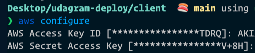

but if you not have one u need to create `IAM` user with `AdministratorAccess` and here's the steps 

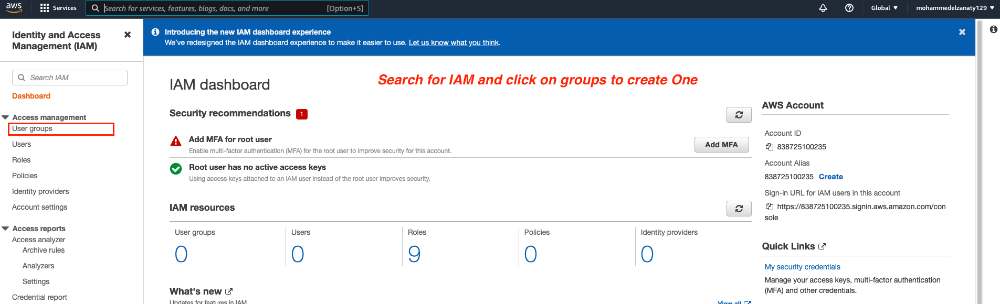
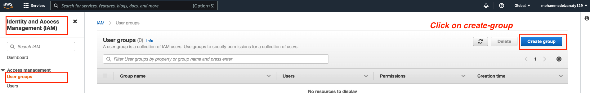

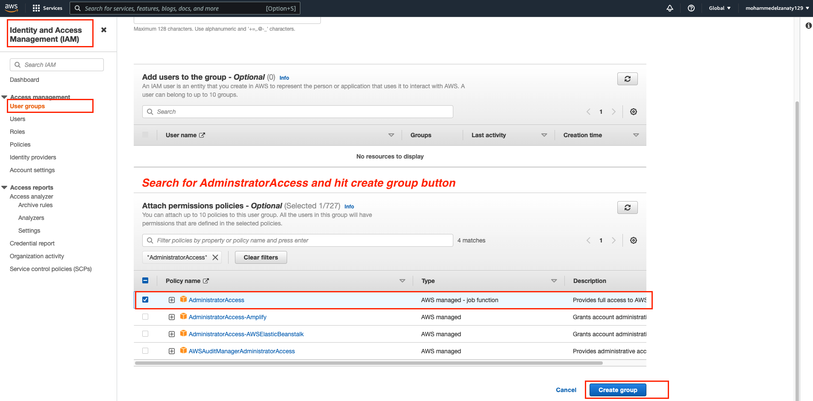

After Creating a group let's create a user and attach admin policy to it

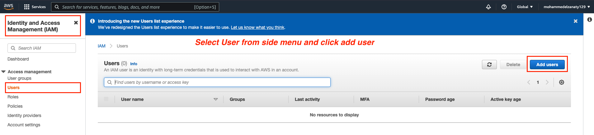
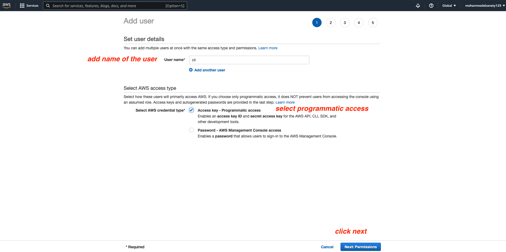
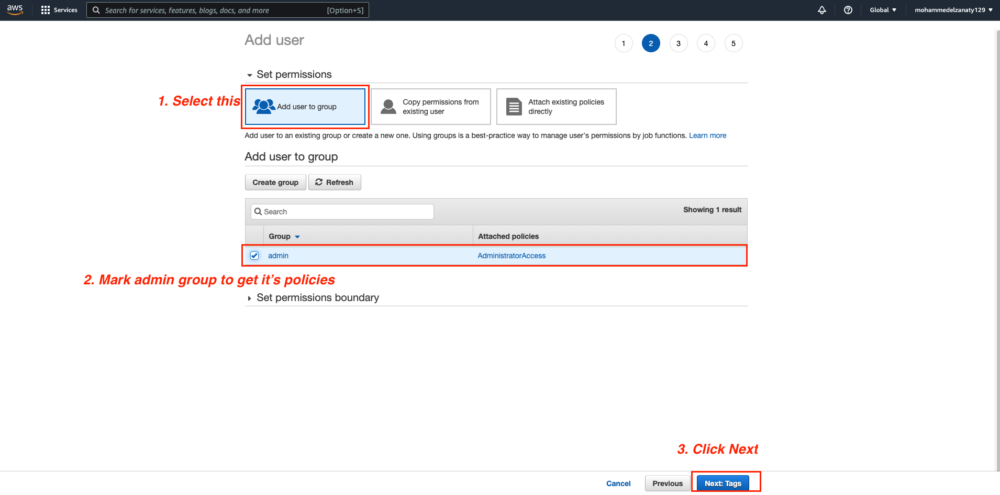
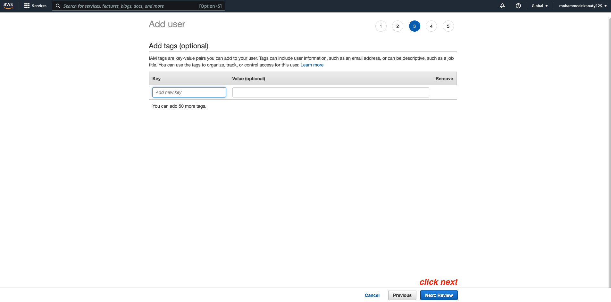
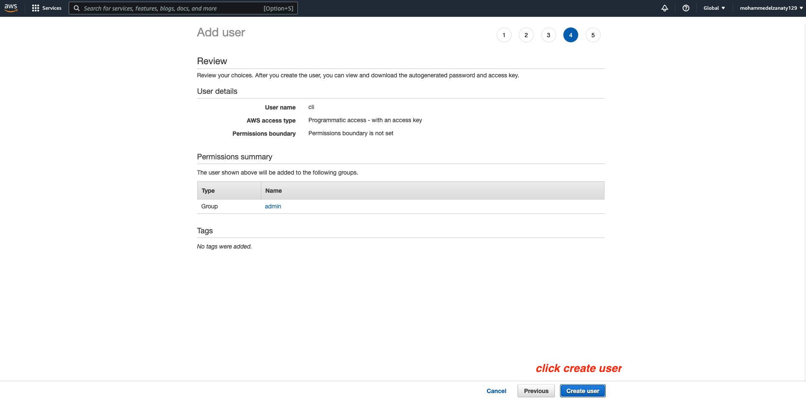
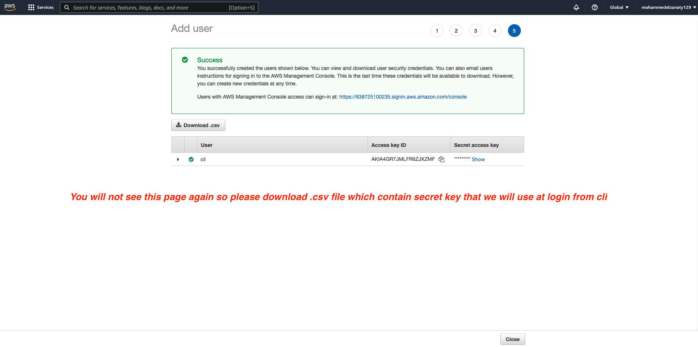

if you still face any issues please go to the [documentation](https://docs.aws.amazon.com/cli/latest/userguide/cli-configure-quickstart.html)

now it's time to run the command to upload again please hands up for this time

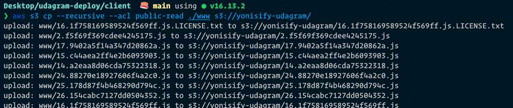
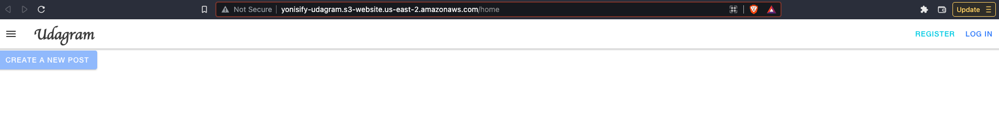


> now it's time for your to have a cup of coffee ☕️  as you done a very cool job till now 


#### 🚀  Elastic Beanstalk

let's start by [docs](https://docs.aws.amazon.com/elasticbeanstalk/latest/dg/create_deploy_nodejs.html) to deploy applications used nodeJS

> Elastic Beanstalk (EB) is a fairly straightforward way of setting up scalable applications. It uses Amazon Elastic Compute Cloud (EC2) instances, Amazon Simple Storage Service (S3) buckets, and load balancers to manage your application architecture for you.

🐻 add `.elasticbeanstalk/` to `.gitignore` file

🐻 Create an Elastic Beanstalk environment

Open your termail and make sure u authenticated to aws and everything is fine then open your server directoy 

1. Create a repository with the **eb init** command.


This command creates a configuration file in a folder named `.elasticbeanstalk` that specifies settings for creating environments for your application, and creates an Elastic Beanstalk application named after the current folder.

2. Create an environment running a sample application with the **eb create** command.

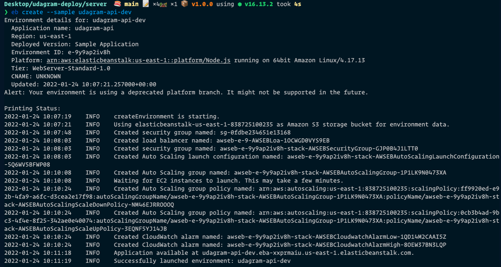

This command creates a load-balanced environment with the default settings for the Node.js platform and if you open the `Elastic Beanstalk` service from you will find your application with the name you speicifed in our case called `udagram-api` with environment `udagram-api-dev`


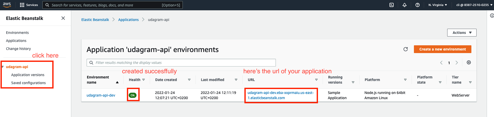

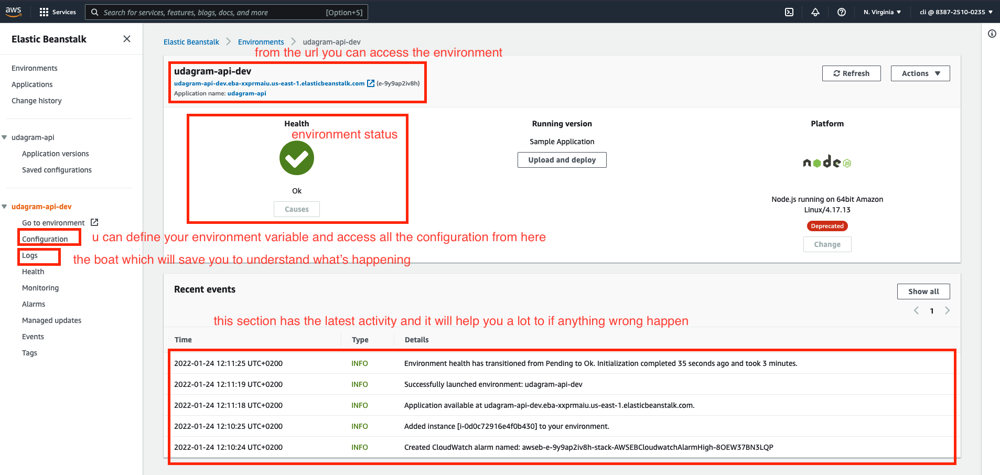

if you open this link now you will see 

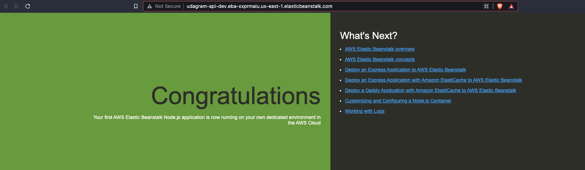

> now it's time for your to have a cup of coffee ☕️  as you done a very cool job till now 

now after createing everything we need to deploy our application on a spcified environment we alread create it let's make sure we are using it by running in rootDir of our server 

```shell
eb use udagram-api-dev
```

now we need to ask our selves a question what we need exactly to deploy mmmmmm 🧐 aha `we need to build our project first and archive what we build and upload it to run it` simple ha so go to rootDir of your server and build the project and archive what we build and this will happen as 

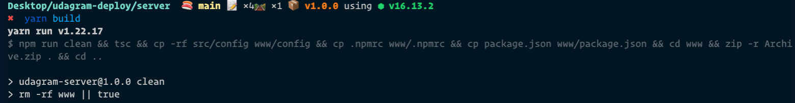

then we need to let the elasticbeanstalk configuration know our intention and where it find the archive folder then deploy then open the link again and this can be done by 

Open `config.yml` in `.elasticbeanstalk` folder and add this 

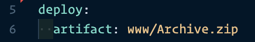

It's time to deploy now again

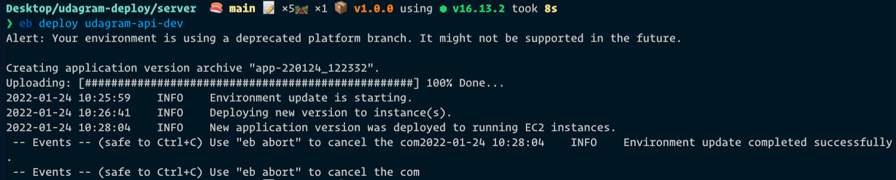

Open link to review what's happening and this can be done from terminal BTW

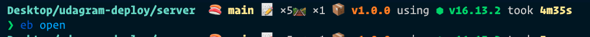

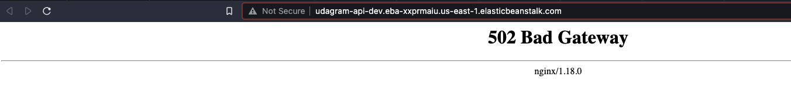

ohhh a problem yes a problem what you expect Sir for sure you will find a problems when you work but no problem my friend I am here for help 

in such cases the only place can save us is `logs` you need to read them and google errors to find the solution and deploy again

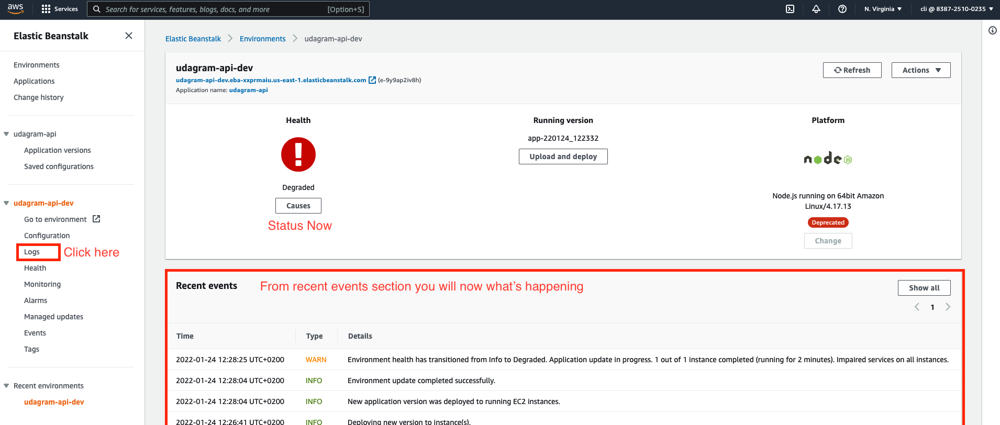

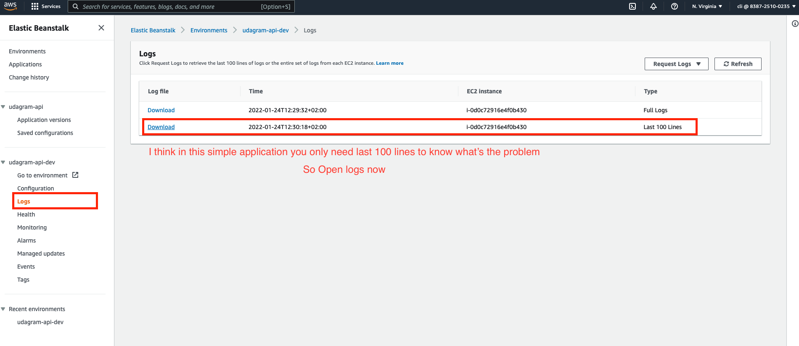

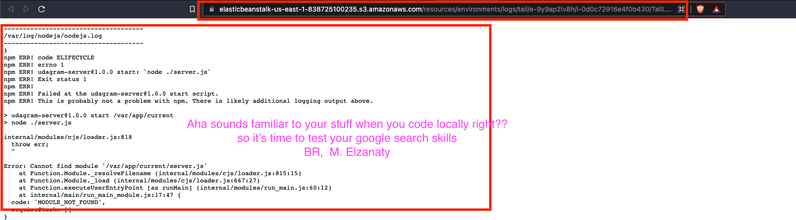

may be you forget to set `environment variables` or something to set them 

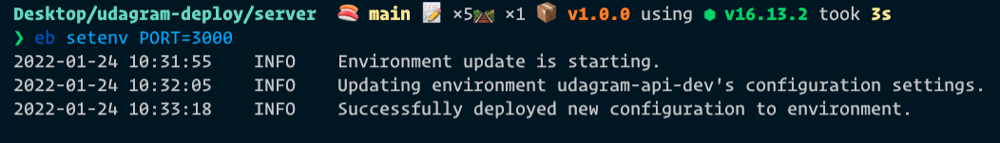

so now you feel issue is fixed right so make the same steps we did before 

1. Build by `npm run build`

2. Deploy again

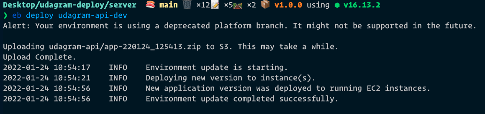
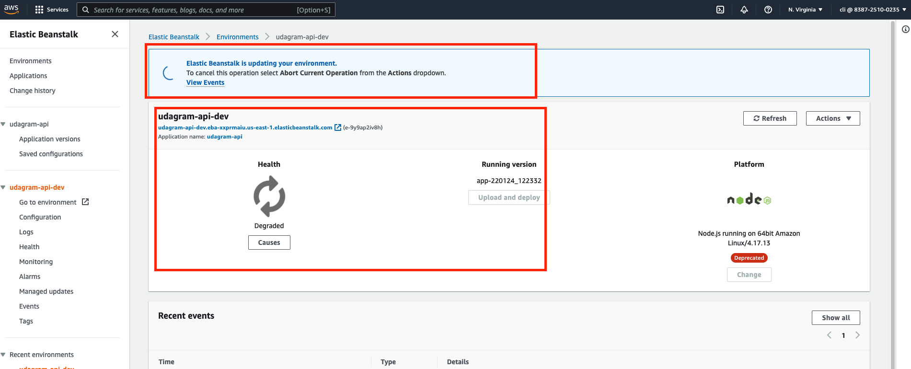

3. Validate 

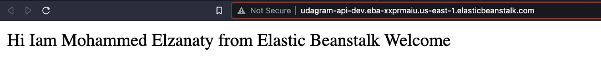
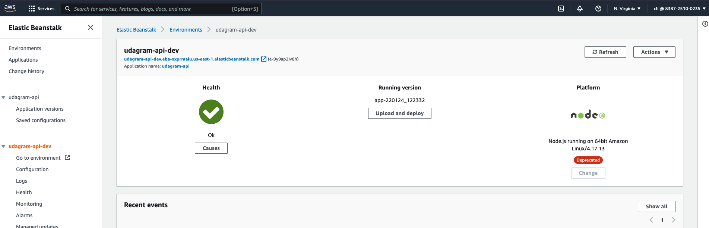

**it's time to clean up**

If you are done working with Elastic Beanstalk, you can terminate your environment.

Use the eb terminate command to terminate your environment and all of the resources that it contains.


<iframe src="https://giphy.com/embed/Y7VSyIgPkYSxG" width="480" height="199" frameBorder="0" class="giphy-embed" allowFullScreen></iframe><p><a href="https://giphy.com/gifs/will-smith-stay-strong-jaden-Y7VSyIgPkYSxG">via GIPHY</a></p>

### 3️⃣ Wire your GitHub repo with **CircleCI**

### 4️⃣ Configure a **CircleCI**

Configure a **CircleCI** pipeline to automate your deployments

### 5️⃣ Document the infrastructure

Document the infrastructure needs (**RDS**, **S3** and **Elastic Beanstalk**, etc) and explain the different steps in the pipeline

###  6️⃣ Create architecture diagrams

Create architecture diagrams for an overview of the infrastructure and the pipeline


## Submission Instructions

🚀 Provide the link to your hosted working Front-End Application in the `README`

🚀 Include a `screenshot` of your last build in `CircleCi` (either include screenshots in the GitHub repo or upload into the Workspace)

🚀 Include `screenshots` of the `configuration` page of your `AWS services` (either include screenshots in the GitHub repo or upload them into the Workspace)

🚀 Your project final project should include the following files and folders:

- `.circleci/config.yml`
- a root level `package.json`
- a `Readme` with some basic documentation
- a docs folder to include architecture diagram and more detailed documentation files (MD format) on infrastructure description, app dependencies, and pipeline process

To review the detailed requirements for the project, look at the project [rubric](https://review.udacity.com/#!/rubrics/3070/view).

## Common Problems


### Issue 1: Zip not working 

**Problem:**  zip and unzip commands are not existed in windows

**Solution** install [Cygwin](https://www.cygwin.com/) and make sure you select `zip` as it's not default 

### Issue 2: Routing
Many of us have found their URL not working after including the link to it in their repositories for submitting their project.
It happened to me, also.
The reason for this error is that you copy the link of the live site from the browser URL field.
This makes you copy the link with an extra unneeded `/home`.
Solution: Just remove the `/home`.

### Issue 3: Testing
Some of us have experienced errors in deployment when they take testing into their consideration.
The reason behind this issue might be the configs of karma. `-your-path-to-frontend-/src/karma.conf.js`
There are no specific configurations to follow. Those who solved this issue played with the following:

```json 
clearContext
autoWatch
singleRun
```

Try changing their values, and things should run smoothly. [Karam configurations](https://karma-runner.github.io/6.3/config/configuration-file.html)

## Issue 4: SQl

**Problem:** 


**Solution**
Issue can be fixed by by downgrading sequelize version to `5.3.5` while keeping sequelize-typescript at version `0.6.11`

## Udacity Style Guides

Although Eslint and Prettier will handle most of your formatting needs, you should write your code and markup to meet the specifications provided in these style guides:

🌳 [CSS Style Guide](/udacity/style-guide/CSS)

🌳 [HTML Style Guide](/udacity/style-guide/html)

🌳 [JavaScript Style Guide](/udacity/style-guide/javascrpt)

🌳 [Git Guide](/udacity/style-guide/git)


> A note on plagiarism: Viewing someone else’s code to get a general idea of implementation, then putting it away and starting to write your own code from scratch is okay. Please do not copy someone's code, in whole or in part. For further details, check out this guide [regarding plagiarism](/udacity/plagiarism).

<Tip>
  I want to give a spcial thanks to <strong>Amr Hassan Abdullah</strong> who is one of the talented engineers working as session lead @ <a href="https://www.udacity.com/">Udacity</a>. to reach <a href="https://www.linkedin.com/in/amr-hassan-abdullah/">Amr</a>
</Tip>